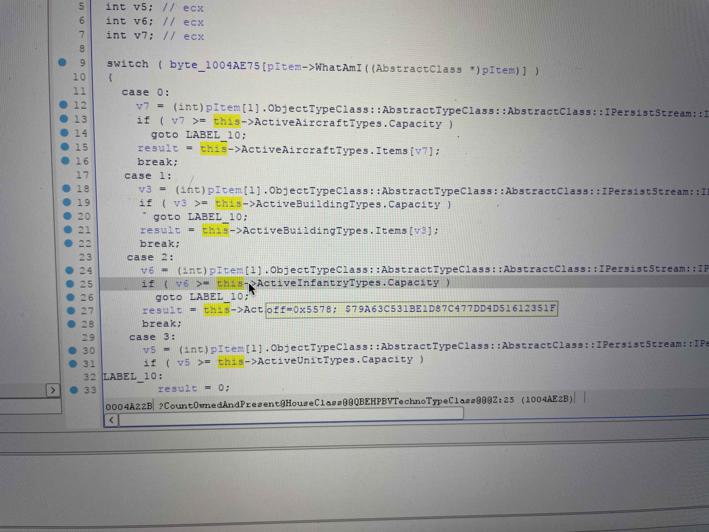
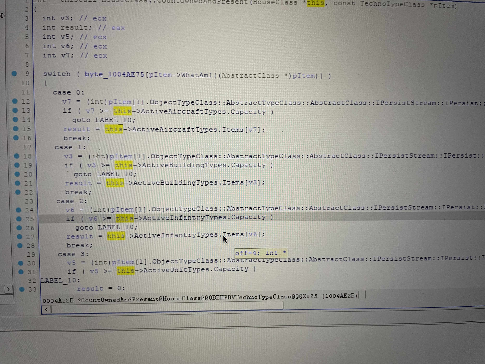

# ra2viewer

## Red Alert 2 viewer plugin

Currently this plugin is capable of showing T1 tank and dog count of both Soviet and Allied forces.

## Function extension

You may add more statistics to this program by finding and appending offsets.

With the framework, you only need to find offsets of the last few steps. The offsets can be classified into two groups: the offsets of a new unit class and the offset of a new unit.

Unit class offsets can be extracted from mod dlls like [Phobos](https://github.com/Phobos-developers/Phobos/releases/tag/v0.3). [YRPP](https://github.com/Ares-Developers/YRpp/blob/master/HouseClass.h) has provided a good reverse engineering reference as well:

```cpp
    // extracted from HoueClass.h

	// Used for: Counting objects currently owned and on the map
	// altered on each object's loss or gain
	// AITriggerType condition uses this
	// original PrereqOverride check uses this
	// original Prerequisite check uses this
	// AuxBuilding check uses this
	CounterClass OwnedBuildingTypes1;
	CounterClass OwnedUnitTypes1;
	CounterClass OwnedInfantryTypes1;
	CounterClass OwnedAircraftTypes1

    // also extracted from HouseClass.h
    
    // I don't want to talk about these
	// read the code <_<

	//  Count owned now
	int CountOwnedNow(TechnoTypeClass const* pItem) const;

	int CountOwnedNow(BuildingTypeClass const* const pItem) const {
		return this->OwnedBuildingTypes.GetItemCount(pItem->ArrayIndex);
	}

	int CountOwnedNow(AircraftTypeClass const* const pItem) const {
		return this->OwnedAircraftTypes.GetItemCount(pItem->ArrayIndex);
	}

	int CountOwnedNow(InfantryTypeClass const* const pItem) const {
		return this->OwnedInfantryTypes.GetItemCount(pItem->ArrayIndex);
	}

	int CountOwnedNow(UnitTypeClass const* const pItem) const {
		return this->OwnedUnitTypes.GetItemCount(pItem->ArrayIndex);
	}
```
From this header, we know that whatever built is classified into four groups: building, unit, infantry and aircraft. Also, the unit count may be collected by calling `CountOwnedNow()`.

```cpp
// extracted from YRPP ArrayClasses.h
int GetItemCount(int index) {
		return this->EnsureItem(index) ? this->Items[index] : 0;
}
```

From this implementation, we know that `GetItemCount()` actually returns value from its `Items` array which we will emulate in our plugin. Further, by inference and practice, I have found the following information:

1. Buildings are counted as in building class (trivial)
2. Dogs as well as GI and Conscript are counted in infantry class
3. Tanks are counted in unit class

Currently the offset of unit and infantry class are included in the source code. If you want to count more than tanks and infantries, you need to find the offset of corresponding class.

I will take the infantry class as an example. From the source code of `Phobos`, we can find calls to `CountOwnedAndPresent()`. As a result, the function implementation of `CountOwnedAndPresent()` must have be in the Phobos dll. With decompiler (`IDA Pro` here) and a `Phobos` dll with debug symbol, you can peek into the function and `IDA Pro` will tell you the offset:



But wait, you encoded the offset as `0x557c`, not `0x5578`, right?

The additional offset of `4` is introduced by the offset of `Items` from the Infantry class:



We do not really care about the base address of the infantry counter class. Rather, we care more about its `Items` array.

As soon as we get the `Items` array base address, we can get the address of the so-called `itemArrayBase` by writing some code following what has been presented. The first problem is solved here.

The second problem is how can we find the offset of different units.

I used `Cheat Engine(CE)` for the finding process. The process is:

A game process (single player mode is strongly recommended here for simplicity and making anti-cheat mechanism happy) is launched. You build some units, search the game memory for their count with `CE`; build more units, search again; destroy some, search again... Finally you will be greeted by **few** (no more than 2) results. You subtract the address with the `itemArrayBase` and get the offset of this unit. Note that if there are multiple address, you are recommended to try the address that produces a smaller offset. If the offset is set correctly, when you relaunch the game with a new offset added, it should function well, counting the new unit. If not, you may take the other offset and retry.


## Licensed under AGPLv3
